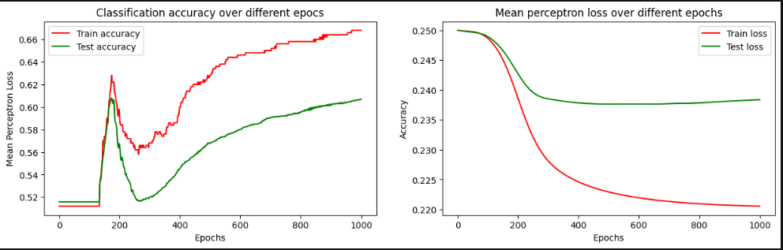
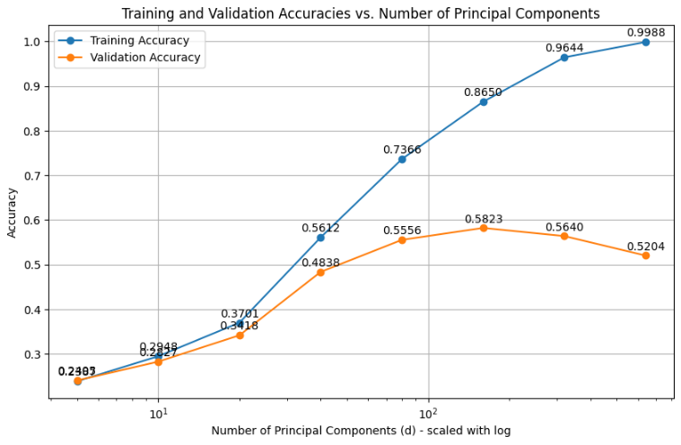
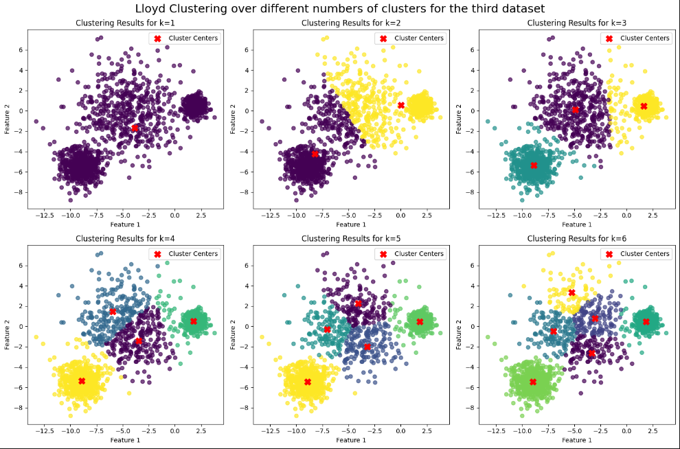

# Machine Learning Class
 This repository consists of the exercises I did for my Machine Learning class in my first semester of my Master Studies, and the topics that I go over are:
 - Linear regression
 - Linear classification
 - Kernels
 - Neural Networks
 - Dimensionality reduction
 - Clustering
 - etc.
Example of the plots that I created:

